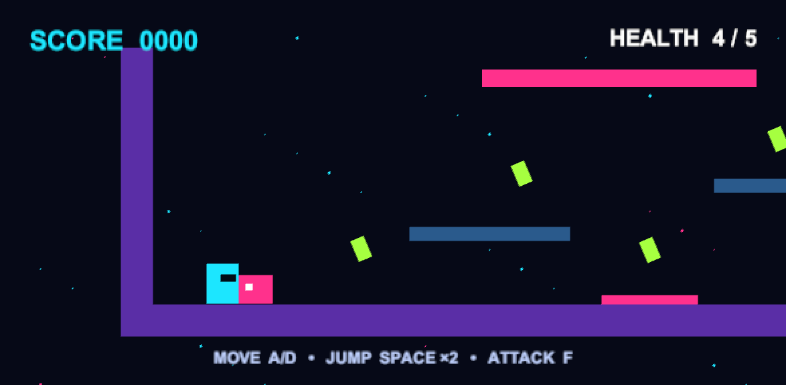

# Neon Survival — Gameplay Mechanics

A compact 2D Unity arena game. Collect green energy crystals, avoid the pink floor hazard, and fight enemies while protecting your health. The project demonstrates damage, physics collisions, scoring, HUD updates, Game Over, and restarting.

## Gameplay mechanics

| Requirement | Implementation |
| --- | --- |
| Player health | Start with 5 HP. Enemy contact or hazard contact deals 1 damage, with 0.6 seconds of invulnerability and flashing feedback. |
| Enemies and obstacles | Three enemies, solid platforms, arena walls, and a damaging floor hazard. |
| Collision detection | Rigidbody2D and BoxCollider2D for solid collisions; trigger colliders for crystals; an overlap query for attacks. |
| Score and collectibles | Each crystal gives 10 points. Defeating an enemy gives 25 points. |
| Score and health UI | Live score, numeric health, and a health bar. |
| Game Over | Reaching 0 HP or falling below the arena disables the player and displays the final score. |
| Restart | Press R or click the Restart button after Game Over to reload the scene, restoring the player, enemies, crystals, health, and score. |

## Bonus mechanics

- **Enemy AI:** patrols when the player is far away, chases within 7 units, and jumps when detecting a wall. Speed increases with score.
- **Double jump:** two jumps between landings. A third airborne jump is blocked.
- **Attack system:** a directional, short-range pulse with a 0.38-second cooldown. Enemies take two hits to defeat.
- **Damage feedback:** brief player knockback and flashing. Movement pauses for 0.18 seconds after a hit so it does not immediately cancel the knockback.

## Controls

| Input | Action |
| --- | --- |
| A / D or Left / Right arrows | Move |
| Space | Jump; press again in the air to double jump |
| F or left mouse button | Attack in the facing direction |
| R after Game Over | Restart |
| Restart button after Game Over | Restart |

## Scripts and functionality

All runtime scripts are in `UnityProject/Assets/Scripts/`.

| Script | Responsibility |
| --- | --- |
| `GameBootstrap.cs` | Builds the arena, sprites, player, enemies, crystals, camera, and UI. A saved bootstrap component runs on every scene load, including restart. Creates the EventSystem required by the restart button. |
| `GameManager.cs` | Tracks score and Game Over, updates the HUD, scales difficulty, and reloads the active scene. |
| `PlayerController.cs` | Reads input in Update; applies movement, ground checks, and jumps in FixedUpdate. Handles attacks and a brief knockback control lock. |
| `PlayerHealth.cs` | Manages health, damage invulnerability, flashing, knockback, falling out of bounds, and defeat. |
| `EnemyAI.cs` | Patrol/chase movement, obstacle detection, enemy health, contact damage, and defeat scoring. |
| `Collectible.cs` | Animates crystals and awards points on player trigger contact. |
| `Hazard.cs` | Applies damage while the player contacts the floor hazard. |
| `CameraFollow.cs` | Smoothly follows the player within arena limits. |

`UnityProject/Assets/Editor/CaptureScreenshot.cs` adds a gameplay capture command to the Unity editor menu.

## Run the project

1. Install **Unity 6 Editor 6000.0.82f1** through Unity Hub. This is the version recorded in `ProjectSettings/ProjectVersion.txt`; the scripts use Unity 6's `Rigidbody2D.linearVelocity` API.
2. Clone/download this repository and add `questline-2/gameplay-mechanics/UnityProject` to Unity Hub.
3. Allow Unity to restore the declared packages and import assets.
4. Open **Assets/Scenes/Main.unity**, press **Play**, and click the Game view to focus input.
5. Keep **Active Input Handling** set to **Both** or **Input Manager (Old)**. The committed setting is Both.

The scene contains a Game Bootstrap object in Edit mode. It creates the playable level when Play starts, so the arena is not visible until then. `Main.unity` is included in the build scene list. No external art downloads are required.

## Gameplay screenshot

This is the existing gameplay capture supplied with the project. To refresh it, enter Play mode and choose **Neon Survival > Capture Gameplay Screenshot**; the image is written to `Media/gameplay.png`.

## Verification checklist

- Move, jump, double jump, land, and jump again; verify that walls/platforms block movement.
- Touch a crystal: it disappears and score increases by 10.
- Attack an enemy twice: it disappears and score increases by 25.
- Touch an enemy or hazard: health decreases, the health bar shrinks, and the player briefly flashes.
- Lose all health: check that Game Over and the final score are visible.
- Restart with R, then repeat with the button: check that health is 5, score is 0, and the level, enemies, and crystals return.

The updated runtime scripts compile against the installed Unity 6 assemblies. Full Play-mode verification could not be completed because the local Unity licensing connection failed. The checklist above describes expected behavior, not a claim that every interaction has been tested.
