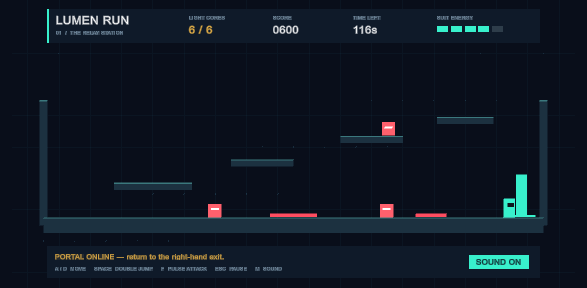
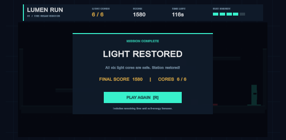
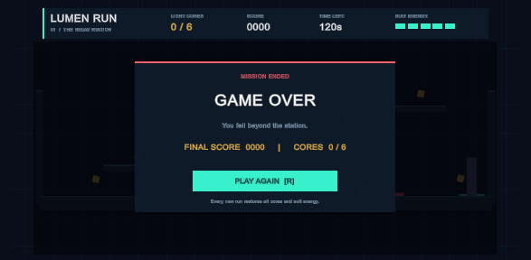
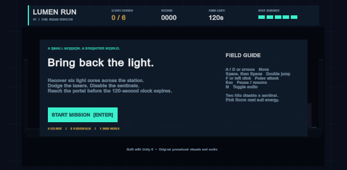

# Lumen Run — Game Architect

**Game type:** 2D platformer / light-core collection game.

Recover six light cores from a damaged relay station. Climb four raised platforms, avoid laser floors, and disable patrolling sentinels. After collecting every core, reach the portal on the right before the 120-second timer expires.

> **Submission status:** Complete. The project was opened in Unity 6000.0.82f1, exercised in Play mode, checked with the included runtime smoke test, and captured from the real Unity Game view.

## Features implemented

- A start menu with the mission and controls; Enter or Start Mission begins the run.
- One designed level with four elevated platforms, two laser hazards, three patrol enemies, six light cores, and a locked exit portal.
- Physics-based movement, double jump, and directional pulse attacks.
- Five health points, damage invulnerability, flashing feedback, and knockback.
- 100 points per core and 150 points per defeated sentinel.
- A win condition: collect all six cores and enter the portal. Winning awards 5 points per remaining second (rounded up), plus 100 per remaining health point.
- Game Over when health reaches zero, time expires, or the player falls out of the station.
- Restart from both result screens; it reloads the scene and restores every object, health, timer, and score.
- Pause/resume freezes the timer and physics simulation.
- Synthesized jump, pickup, attack, hurt, start, win, and lose sound effects, plus a quiet looping melody. M toggles audio.
- A coordinated teal/gold interface with score, time, core progression, health blocks, mission hints, and separate win/lose screens.

## Controls

| Input | Action |
| --- | --- |
| Enter / Start Mission | Start from the menu |
| A / D or Left / Right arrows | Move |
| Space | Jump; press again in the air to double jump |
| F / left mouse button | Pulse attack; two hits defeat a sentinel |
| Esc | Pause / resume |
| M | Toggle sound and music |
| R / Play Again | Restart from win or Game Over |

## Technologies used

- **Unity 6, 6000.0.82f1**, using the Built-In Render Pipeline.
- **C# / MonoBehaviour** for state management, movement, interactions, audio, and interface logic.
- **Rigidbody2D, CapsuleCollider2D, BoxCollider2D** for physics and collision detection.
- **Unity IMGUI** for the scalable HUD and menus; no external UI package is required.
- **AudioClip / AudioSource** for original synthesized audio. Visuals are generated from simple sprites; there are no downloaded art or audio dependencies.

## Project layout and scripts

Open `UnityProject`, which contains `Assets`, `Packages`, and `ProjectSettings`.

| Script | Purpose |
| --- | --- |
| `GameSession.cs` | Menu/playing/paused/won/lost states, health, score, timer, progression, exit rules, and restart. |
| `LevelBuilder.cs` | Constructs the complete level, player, enemies, portal, procedural sprites, and visual pulses. |
| `Runner.cs` | Input, physics movement, grounded checks, two jumps, attacks, knockback, and damage flashing. |
| `Sentinel.cs` | Patrol and enemy health; also contains trigger logic for cores, hazards, and the portal. |
| `GameHud.cs` | Start menu, HUD, pause overlay, win screen, and Game Over screen. |
| `SoundSynth.cs` | Generates all sound clips and looping music and handles mute. |
| `Editor/CaptureTools.cs` | Captures real Game-view screenshots and frame sequences. |
| `Editor/SubmissionCapture.cs` | Drives a deterministic Play-mode showcase through real triggers and produces the submitted screenshots and video frames. |
| `Editor/LumenSmokeChecks.cs` | Runs an editor smoke check for initial state, damage cooldown, pause, a real pickup trigger, win conditions, restart, and falling defeat. |

## How to run

1. Install **Unity Editor 6000.0.82f1** in Unity Hub and ensure a valid license is active.
2. Clone/download the repository and add `questline-3/game-architect/UnityProject` to Unity Hub.
3. Open `Assets/Scenes/Main.unity`. It contains the saved Lumen Run bootstrap component.
4. Press Play. The level is generated on entering Play mode and the start menu appears.
5. Click the Game view and press Enter, or click Start Mission. A 1280 × 720 Game view is recommended for capture.
6. Keep **Active Input Handling** set to **Both** or **Input Manager (Old)**; the project uses the legacy Input API.

`Main.unity` is enabled in the build scene list. Reloading that saved scene reconstructs the full game and returns to the start menu.

## Screenshots and gameplay video

All images below were captured from the real Unity Game view while the project was running.

### Start menu

### Active level and HUD

### Win and Game Over

### Gameplay recording

[Download the 10-second gameplay video (AVI)](Media/gameplay-video.avi). The video follows the real Play-mode run from the menu through collection, portal completion, restart, and Game Over. The frame-based recording is silent; synthesized music and effects play in the Unity project.

## Challenges faced

- **Complete restart:** a scene-bound bootstrap reconstructs all state when the scene reloads, instead of relying on a startup-only initialization hook.
- **Input and physics timing:** input is collected in Update and velocity/jumps are applied in FixedUpdate. A short control lock preserves knockback.
- **Reliable progression:** cores can only be collected once, defeated enemies award score once, and the portal remains locked until six cores are recovered.
- **Clear state transitions:** menu, pause, and result screens disable physics so the level does not advance behind an overlay.
- **Self-contained presentation:** procedural sprites and synthesized audio keep the project small and avoid third-party asset licensing requirements.
- **Repeatable evidence:** the editor capture command records a deterministic route through production gameplay code so the screenshots and video can be regenerated without mock assets.

## Validation

The project imported and compiled in Unity **6000.0.82f1**. **Lumen Run > Run smoke checks** completed all 12 Play-mode assertions; the complete report is in [`Media/runtime-validation.txt`](Media/runtime-validation.txt). It verifies the initial menu and HUD state, player freeze/start behavior, health and damage invulnerability, pause timing, a real physics pickup trigger, locked portal behavior, full progression and win, scene restart and enemy restoration, and falling Game Over.

The submitted images and 122-frame gameplay recording verify the rendered menu, active level/HUD, win screen, and Game Over screen. The project also passed direct C# compilation against the installed Unity 6 assemblies, and its scene/build GUID references were checked.
